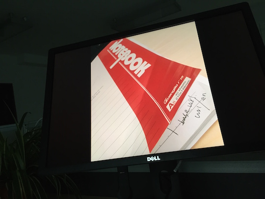

# google-cast-local

This is a sample project to test how to use google cast.

### Depedency
> - com.google.android.gms:play-services-cast:`6.5.87`
> - com.android.support:mediarouter-v7:`21.0.3`
> - com.android.support:appcompat-v7:`21.0.3`
> - [NanoHTTPD](https://github.com/NanoHttpd/nanohttpd)

### In this project you can:

> - **Cast image from internet**
>> -  ChromeCast request image from internet directly

> - **Cast local image**
>> After choosing an image from local by startActiviytForResult. Then this it will cast this image to ChromeCast, then ChromeCast will request local http Server in you device.And server will return the image to ChromeCast.

### ScreenShots

> - MainActivity: 
> 
> 

> - Choose image of internet: 
> 
> 

> - Choose local image: 
> 
> 

> - Cast on TV
> 
> 

### Me

> - WEIBO: [@hyongbai](http://weibo/hyongbai)
> - TWEET: [@hyongbai](http://twitter.com/hyongbai)
> - GMAIL: [hyongbai@gmail.com](mailto://hyongbai@gmail.com)

